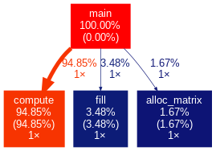
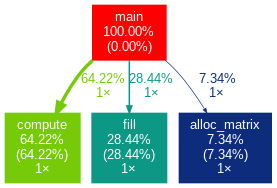

# Laboratorio III - Sistemas Operativos 2 - Francisco Daniele
### Ingeniería en Computación - FCEFyN - UNC
# Optimizaciones de código

## Desarrollo
Para el desarrollo del trabajo organicé mis archivos creando una carpeta _/src_ donde se encuentra el archivo del programa original del laboratorio y el código optimizado creado por mi, además de que mediante makefile se guardan los ejecutables en /src/bin.

También cree una carpeta llamada profiling donde se guardan los archivos de texto que guardan informacion de profiling mediante gprof sobre las corridas del programa con las sucesivas optimizaciones que fui haciendo.

## Profiling
Existen varias herramientas de profiling gratuitas con distintos approachs y utilidades particulares de cada una. A continuación una pequeña lista de algunas:
-   gprof
-   Valgrind
-   google-perftools
  
Entre otras. Quizá la más completa es Valgrind, ya que cuenta con distintas herramientas como:
-   callgrind, que hace profiling de la cantidad de instrucciones assembler que implica cada funcion de un programa 
-   cachegrind, analiza la utilización de la caché L1 y Last Level, de datos e instrucciones, con miss rate
-   memcheck que es un detector de errores de memoria
-   etc...

No obstante, para poder medir el rendimiento del programa original y a medida que iba trabajando decidí servirme de _gprof_. Fue así ya que este es más rápido y ágil que Valgrind porque su ejecución demora menos, tiene un output más fácilmente analizable y permite encontrar los hotspots del programa enseguida. A pesar de dar menos información, la que nos ofrece es más que suficiente para el desarrollo del laboratorio.
Este profiler sirve para ejecuciones de C, Pascal y Fortran. Para utilizarlo se compila al programa con la opción -pg de gcc, se lo ejecuta y se genera un archivo _gmon.out_. Luego se analiza ese archivo y se genera un .txt leible para analizar el rendimiento de la ejecución.
Además, para una mejor visualización y presentación de los datos obtenidos, utilicé gprof2dot el cuál es un script en python desarrollado por José Fonseca (https://github.com/jrfonseca). Este programa analiza la salida de gprof y la transforma en una imagen.

Para ir comparando, realice el profiling del programa original, y luego con cada potencial optimización que realizaba hacía lo mismo con el programa resultante e iba guardando los resultados y comentando los cambios hechos.

El profiling de la ejecución inicial (sin prints) dio los siguientes resultados en segundos:
-   6.83 de ejecución de la función compute
-   0.23 para la función fill
-   0.13 para alloc_matrix

Con esos resultados enseguida se ve que el objetivo principal a optimizar es _compute_ ya que determina el 95% del tiempo de ejecución del programa completo.

## Cambios y Optimizaciones
Para empezar comenté las instrucciones de _printf_ ya que hacían la ejecución muy lenta e imposible de ir analizando. Solo mostraba algunos valores finales para poder ir corroborando que el resultado obtenido por optimizar era el mismo que el original. Por esto también comenté las lineas que daban distintas seed para random para mantener la misma siempre. A continuación comenté unas declaraciones de variables que no se utilizaban y "reparé" la inicialización de la variable _kern_ para que el programa compile con las flags requeridas. También agregué al final la liberación de la memoria alocada mediante _free_.

1.  La primera optimización que hice fue hacer un loop unrolling del siguiente _for_: 
~~~
for(k = 0; k < 3; k++)
    for(l = 0; l < 3; l++)
        accum = accum + tmp_sum[k*3+l];
~~~
Primero del segundo con la variable _l_ obteniendo un tiempo de ejecución de 4.89 segundos en la función _compute_ y luego del bucle de _k_ obteniendo 3.97 segundos.
El código quedó de la sig. manera:
~~~
double tmp = tmp_sum[0] + tmp_sum[1] + tmp_sum[2];
accum = accum + tmp;
tmp = tmp_sum[3] + tmp_sum[4] + tmp_sum[5];
accum = accum + tmp;
tmp = tmp_sum[6] + tmp_sum[7] + tmp_sum[8];
accum = accum + tmp;
~~~

2.  Luego detecté que la variable _x_ en cada iteración de _i_ valía _i - 1_ y era calculada en el bucle de _j_ por lo que innecesariamente se calculaba un montón de veces. Cambiando eso obtuve una mejora de la ejecución de _compute_ llegando a 3.47 segundos.
   
3.  La siguiente optimización fue un doble loop unrolling de:
~~~
for(k = 0; k < 3; k++)
    for(l = 0; l < 3; l++){
        int x = i + (l-1);
        dato = arr[x][j];
        tmp_sum[l*3+k] = 2*(2*kern[l][k]*dato)/1000 + 1;
    }
~~~
Quedando:
~~~
dato = arr[x][j];
tmp_sum[0] = 2*(2*kern[0][0]*dato)/1000 + 1;
tmp_sum[1] = 2*(2*kern[0][1]*dato)/1000 + 1;
tmp_sum[2] = 2*(2*kern[0][2]*dato)/1000 + 1;

dato = arr[x + 1][j];
tmp_sum[3] = 2*(2*kern[1][0]*dato)/1000 + 1;
tmp_sum[4] = 2*(2*kern[1][1]*dato)/1000 + 1;
tmp_sum[5] = 2*(2*kern[1][2]*dato)/1000 + 1;
                        
dato = arr[x + 2][j];
tmp_sum[6] = 2*(2*kern[2][0]*dato)/1000 + 1;
tmp_sum[7] = 2*(2*kern[2][1]*dato)/1000 + 1;
tmp_sum[8] = 2*(2*kern[2][2]*dato)/1000 + 1;
~~~
Y así obtuve un tiempo de ejecución de 3.35 segundos de la función _compute_.

4.  A continuación cambié la doble multiplicación por 2 que se realizaba por una sola por 4, reduciendo así la inmensa cantidad de multiplicaciones que se realizaba, la cual es una instrucción relativamente lenta. Obtuve un tiempo de ejecucíon de _compute_ de 3.07 seg.

5.  Luego reduje en gran medida la cantidad de sumas realizadas viendo la constante suma (9 veces) _+ 1_ y reemplazandola directamente inicializando _accum_ en 9, produciendo el mismo efecto. Así obtuve 2.65 segundos de ejecución de _compute_.

6.  Luego me di cuenta que la variable _kern_ tenía valores que eran '0' y esta era multiplicada un montón de veces, siendo el resultado de esto también '0'. Por lo que eliminé dichas multiplicaciones y por consiguiente también la suma de los resultados de esas operaciones, reduciendo así la ejecución de _compute_ a 2.01 segs.

7.  La siguiente optimización fue reemplazar la división constante por 1000, ya que esta es una instrucción que consume muchos ciclos de clock, y lo hice multiplicando por 0.001 que es mucho más rápido. Así llegué a un tiempo de ejecución de 1.50 segundos.

8.  Cómo la multiplicación por 0.001 se hacía a valores que luego se iban a sumar (era factor común), reduje la cantidad de multiplicaciones a solo 1 haciendola al final luego de la suma y así bajó el tiempo de _compute_ a 1.29 seg.

9.  Lo próximo fue reducir de 9 a 2 el tamaño del arreglo _tmp_sum_ ya que no era necesario que sean tantos elementos y agrupando reduje algunas sumas y multiplicaciones que se realizaban de más innecesariamente llegando a 1.12 segundos de ejecución.

10. Eliminé la multiplicación por 4 directamente aplicandola a los valores de _kern_ obteniendo así el mismo resultado y bajando la ejecución a 1 segundo.

11. Luego saqué una variable temporal innecesaria junto con algunas asignaciones de variables juntando operaciones y el tiempo se redujo a 0.87 segs.

12. Para que las operaciones sean más rápidas, pasé de _double_ a _float_ las variables manipuladas y así, a cambio de un error de redondeo de 0.000001 por pasar de precisión doble a simple en aprox. el 30% de los elementos de la matriz, conseguí pasar a 0.79 segundos de ejecución de _compute_.

13. Por último eliminé el siguiente _if_:
~~~
if(i >= 1 && j >=1 && i < XDIM-1 && j <YDIM-1)    
~~~
el cual conlleva muchísimas comparaciones, predicción y saltos. Para esto cambié los límites de los bucles sacando los valores que no cumplían con la condición al ver las implicaciones que dicho _if_ generaba en los resultados para todo _x_ cuando _i_ y _j_ tomaban esos valores:
-   arr[0][x] = 0
-   arr[x+1][0] = arr[x][9999]
-   arr[x][9999] = arr[x][9998]
-   arr[9999][x] = arr[9998][9999]

Gracias a esto, se llegó a 0.70 segundos de _compute_.

## Análisis
### Programa original vs programa optimizado
Luego de todas las optimizaciones, se pasó de un tiempo total de ejecución de 7.19 segundos a 1.11, lo que implica una mejora de ~6.5 veces. Además, se pasó de que _compute_ (claramente el cuello de botella de este programa) pase de suponer el 95% de la ejecución total a el 64%. 

<table>
<tr>
<th> Original </th>
<th> Optimizado </th>
</tr>
<tr>
<td>

</td>
<td>

</td>
</tr>
</table>

### Más optimizaciones?
Probablemente aún se puedan seguir realizando optimizaciones como algún loop unrolling, alguna forma de pasar de _int_ a _float_ (en _fill_) más eficiente que un casteo o evitar la operación modulo (también en fill) la cuál conlleva muchos ciclos de clock. También, tal vez, podría hacerse _cache blocking_ en el _for_ anidado de _compute_ para mejorar el acceso a variables juntandolas en caché.

Personalmente pienso que se llegó a un nivel de optimización más que aceptable, además de tener un código fácilmente legible, por lo que considero innecesario el esfuerzo y modificaciones de código que supondría seguir optimizando.

## Testing
Para testear al principio comparaba el resultado de algunos valores aleatorios de la matriz obtenidos con los originales y realizaba el profiling de cada ejecución.

Más adelante hice un script de bash (_test.sh_) el cuál mediante el cmd _date_ obtiene un timestamp, ejecuta el programa modificado, se guarda su resultado en un _txt_ y con otro timestamp toma el tiempo que se demoró en ejecutar. Luego realiza el profiling de dicha ejecución.
A continuación hace lo mismo con el programa original y al final, mediante _diff_, realiza una comparación de los resultados de las dos ejecuciones y en caso de haber diferencias las imprime.

## Bibliografía
Para poder desarrollar el trabajo obtuve información de las siguientes fuentes:
-   https://stackoverflow.com/
-   https://cs.famaf.unc.edu.ar/~nicolasw/Docencia/CP/2-cpuopt.html#slide14
-   https://www.agner.org/optimize/optimizing_cpp.pdf
-   http://icps.u-strasbg.fr/~bastoul/local_copies/lee.html
-   https://www.thegeekstuff.com/2012/08/gprof-tutorial/